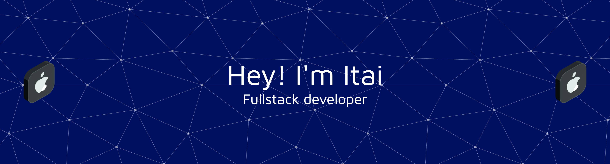

### Hi there 👋

I'm a software developer with a passion for building elegant and efficient web applications. I love exploring new technologies and sharing what I learn through blogging.

#### About Me

* 🌱 I'm currently focusing on learning and building stable and scalable end-to-end projects with various technologies.
* 📝 I'm interested in **blogging about software topics**, from front-end frameworks to best practices.

#### Techs
<h3 align="left">Languages and Tools:</h3>

   
    
   
    
   
   
   
   
   
   
   
<!--     --> 
   
    
   
   
     

#### Get in touch

* You can find me on [Linkedin](https://www.linkedin.com/in/itai-klapholtz).
* My blog on [Medium](https://medium.com/@itaikla).

<!--
**itaikla/itaikla** is a ✨ _special_ ✨ repository because its `README.md` (this file) appears on your GitHub profile.

Here are some ideas to get you started:

- 🔭 I’m currently working on ...
- 🌱 I’m currently learning ...
- 👯 I’m looking to collaborate on ...
- 🤔 I’m looking for help with ...
- 💬 Ask me about ...
- 📫 How to reach me: ...
- 😄 Pronouns: ...
- ⚡ Fun fact: ...
-->
